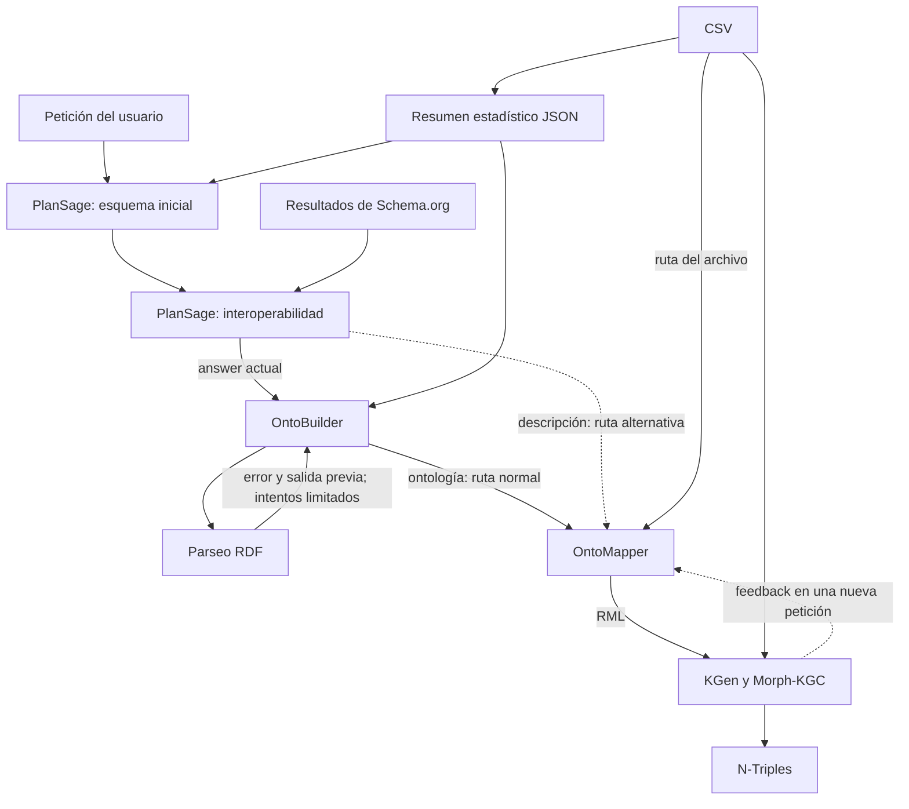

**OntoGenix: especialización de agentes y contexto por tarea**

Borrador técnico para el portfolio, preparado el 25 de septiembre de 2026. Código consultado: `tecnomod-um/OntoGenix`, commit `3c1693b6f1292920b479027fe889af9861d99555`, coincidente con el HEAD remoto al realizar esta revisión. Inspección de código, prompts, documentación y artefactos guardados; no se ha ejecutado la aplicación ni reproducido la evaluación.

**La aportación y el problema**

Mikel confirma que desarrolló el concepto, la arquitectura, la implementación y la redacción del artículo. Otros miembros del equipo realizaron la validación. Se conserva la autoría compartida del proyecto y la publicación.

El problema de diseño confirmado por Mikel era que encargar varios pasos complejos a un agente producía alucinaciones y errores. La especialización permitía acotar la tarea y seleccionar el contexto necesario. Esta observación explica la motivación histórica; no constituye una medición comparativa de la reducción de errores.

Texto propuesto para abrir el caso en inglés:

> I developed OntoGenix from its initial concept through architecture, implementation and manuscript writing. A central challenge was decomposing ontology engineering into specialised tasks while preserving the information each stage needed. In development, asking agents to perform several complex steps led to hallucinations and errors. I addressed this by narrowing their responsibilities and constructing task-specific inputs. Other members of the research team carried out the validation.

**Cómo está construido**

El controlador `GuiBehavior` instancia los agentes, conserva sus resultados y conecta las acciones con la interfaz. Las llamadas de texto del cliente base envían el rol de sistema y un mensaje construido para la petición. La continuidad entre etapas reside en el estado y los artefactos de la aplicación, que se incorporan explícitamente a los prompts. No hay un historial conversacional completo añadido automáticamente a estas llamadas. [Controlador][controller] · [Cliente base][base]

| Etapa | Qué recibe realmente | Qué aporta al siguiente paso |
|---|---|---|
| Preparación de datos | CSV seleccionado | Resumen por columnas con tipos, recuentos y estadísticas, convertido a JSON. El camino de carga no envía el CSV completo al planificador. |
| PromptCrafter, opcional | Petición y resumen JSON | Una propuesta de instrucciones que se extrae de la respuesta y pasa al campo de petición de la interfaz. |
| PlanSage, diseño inicial | Tarea, resumen JSON, metadatos textuales opcionales y, si se adjunta, imagen | Descripción con clases, relaciones y propiedades propuestas. |
| PlanSage, interoperabilidad | Descripción anterior y resultados de búsqueda de entidades de Schema.org | Una segunda respuesta sobre prefijos y correspondencias externas; ver el riesgo de conservación del esquema descrito más abajo. |
| OntoBuilder | Resumen JSON y `plan_builder.answer`; en corrección, también el error | Ontología en Turtle, que se intenta parsear como grafo RDF. |
| OntoBuilder, enriquecimiento de entidad | Tarea, descripción y entidad indicada | Una definición de entidad para actualizar el grafo. La plantilla menciona la ontología completa, pero el código no la añade como argumento separado. |
| OntoMapper | Por defecto, ontología; en la ruta alternativa, descripción. También ruta del CSV, formato, ejemplo y feedback disponible | Mapping RML. La ruta normal no le entrega simultáneamente todo el esquema y el resumen JSON. |
| KGen / Morph-KGC | Mapping guardado, configuración y CSV | Materialización y serialización en N-Triples; registra estado y feedback de error. |

Fuentes: [datos][data], [carga][load], [PromptCrafter][crafter], [PlanSage][planner], [búsqueda externa][search], [OntoBuilder][builder], [mapping][mapping], [KGen][kgen].

Genie constituye el plano de coordinación: recibe la petición, el estado actual y los estados siguientes posibles; extrae una acción, intenta realizar la transición y utiliza llamadas a funciones para invocar las operaciones disponibles. No necesita recibir todos los artefactos de dominio para esa selección. El autómata define transiciones explícitas, mientras que las operaciones comprueban algunas precondiciones, como disponer de datos o de una descripción previa. Esto delimita el flujo, pero no permite afirmar que toda acción y todo argumento quedan formalmente verificados. [Genie][genie] · [Autómata][automaton]

**Diagrama del flujo observado**

Fuente editable: [ontogenix-context.mmd](ontogenix-context.mmd). Representa el camino principal y la alternativa de mapping; no una traza de ejecución ni todos los controles de la interfaz.

**Decisiones que permiten demostrar nivel técnico**

1. **Separar interpretación, formalización y mapping.** El sistema distribuye responsabilidades entre módulos con instrucciones y salidas distintas. La motivación histórica —errores al acumular pasos complejos— está confirmada por el autor. La contrapartida observable es que aparecen fronteras donde hay que conservar significado, nombres y formatos. No hay evidencia aquí de que un benchmark aislara el efecto de esta decisión.
2. **Preparar el contexto a partir de artefactos de cada etapa.** El resumen JSON, la descripción y la ontología cumplen funciones diferentes. El beneficio de diseño es poder inspeccionar qué recibe cada componente; el coste es mantener la integridad y vigencia de esos artefactos. Esta explicación del compromiso se deduce de la implementación, sin atribuir un ahorro de tokens medido.
3. **Combinar generación con comprobaciones ejecutables.** Tras generar una ontología, el controlador intenta parsearla. En el camino de error sintáctico incorpora el mensaje y el texto problemático a una nueva petición; `generate_ontology` establece hasta cuatro intentos. Parsear Turtle no demuestra corrección semántica ni adecuación al dominio. [Reintentos][retries] · [Parseo][parse]

**Un recorrido concreto con materiales existentes**

La carpeta `datasets/AmazonRating/crafted` contiene una petición inicial, una descripción, una ontología y un mapping. Permite mostrar cómo una intención de modelado se refleja en representaciones diferentes:

- La [petición guardada][sample-prompt] pide organizar el modelo alrededor de pedidos, clientes y artículos.
- El [esquema guardado][sample-schema] propone `SalesOrder`, `Customer` y `SalesArticle`, con relaciones como `hasCustomer` y `hasProduct`.
- La [ontología guardada][sample-ontology] expresa clases y propiedades en Turtle.
- El [mapping guardado][sample-mapping] conecta columnas como `UserId`, `ProductId` y `Rating` con recursos y propiedades del grafo.

Son artefactos almacenados en el repositorio, no una ejecución reproducida ni una prueba de que los generó exactamente el HEAD actual. Tampoco se ha validado aquí su corrección. Sirven para enseñar las fronteras entre representaciones y explicar qué debería verificarse en cada una.

**Qué mejoraría hoy: observaciones de la versión inspeccionada**

Estas observaciones ayudan a preparar una reflexión técnica concreta. No son incidentes históricos atribuidos a Mikel ni fallos reproducidos en ejecución.

| Observación del código | Consecuencia o riesgo | Mejora propuesta para una evolución futura |
|---|---|---|
| `create_data_description` guarda el esquema inicial, solicita el enriquecimiento y después `ontology_interaction` consume `plan_builder.answer`. Cada llamada de texto reinicia `answer`. La plantilla de enriquecimiento solicita prefijos y enlaces. | El diseño inicial no se conserva como un campo separado en la entrada del constructor; si la segunda respuesta contiene solo lo solicitado, puede perderse parte del esquema. | Conservar por separado perfil de datos, esquema, alineamientos externos y ontología. Construir cada entrada desde campos explícitos, con versión y procedencia. |
| La extracción de secciones usa delimitadores de texto; por ejemplo, el código busca `**Classes:**` mientras la plantilla contiene `**classes:**`. | El contrato depende de que el modelo emita encabezados exactos. El camino de extracción puede devolver `None`. | Salidas estructuradas, validación de campos y errores explícitos antes de avanzar. |
| `create_mapping` dispone de feedback, pero su bucle automático de reintentos está comentado; la materialización se dispara por otra operación. | La documentación describe más automatización de la que acredita este camino del código. | Describir la corrección como asistida en este caso; si se evoluciona, implementar una política acotada con condición de éxito y trazas. |

Evidencia de las dos primeras observaciones: [flujo de descripción][description], [actualización de PlanSage][planner-update], [plantilla de interoperabilidad][interop-prompt], [cliente base][base], [consumo del contexto][retries], [extracción de secciones][schema-extraction], [plantilla de diseño][schema-prompt]. Evidencia de la tercera: [mapping][mapping] y [materialización desde el controlador][materialization].

**Evaluación y límites del relato**

La [evaluación del equipo](https://github.com/tecnomod-um/OntoGenixEvaluation) debe presentarse por separado de estas comprobaciones de software. No se atribuye al autor su ejecución ni se interpreta como una prueba causal del efecto de especializar agentes. Para redactar cifras se conservarán el protocolo y las condiciones recogidas en el plan general.

La versión del portfolio debe permitir seguir esta cadena: problema observado por el autor → separación de tareas → entradas concretas → implementación → límites y evolución propuesta. Su afirmación central será que Mikel diseñó e implementó esa solución; no que el sistema elimine alucinaciones o garantice corrección semántica.

[controller]: https://github.com/tecnomod-um/OntoGenix/blob/3c1693b6f1292920b479027fe889af9861d99555/GUI/GuiManager/GuiBehavior.py#L221
[base]: https://github.com/tecnomod-um/OntoGenix/blob/3c1693b6f1292920b479027fe889af9861d99555/GUI/LLM_base/LlmBase.py#L87
[data]: https://github.com/tecnomod-um/OntoGenix/blob/3c1693b6f1292920b479027fe889af9861d99555/GUI/tools/tools.py#L255
[load]: https://github.com/tecnomod-um/OntoGenix/blob/3c1693b6f1292920b479027fe889af9861d99555/GUI/GuiManager/GuiBehavior.py#L859
[crafter]: https://github.com/tecnomod-um/OntoGenix/blob/3c1693b6f1292920b479027fe889af9861d99555/GUI/PromptCrafter/LLM_promptCrafter.py#L29
[planner]: https://github.com/tecnomod-um/OntoGenix/blob/3c1693b6f1292920b479027fe889af9861d99555/GUI/PlanSage/LLM_planner.py#L65
[search]: https://github.com/tecnomod-um/OntoGenix/blob/3c1693b6f1292920b479027fe889af9861d99555/GUI/PlanSage/RAG_google.py#L22
[builder]: https://github.com/tecnomod-um/OntoGenix/blob/3c1693b6f1292920b479027fe889af9861d99555/GUI/OntoBuilder/LLM_ontology.py#L66
[mapping]: https://github.com/tecnomod-um/OntoGenix/blob/3c1693b6f1292920b479027fe889af9861d99555/GUI/GuiManager/GuiBehavior.py#L633
[kgen]: https://github.com/tecnomod-um/OntoGenix/blob/3c1693b6f1292920b479027fe889af9861d99555/GUI/KG_Generator/KGEN.py#L32
[genie]: https://github.com/tecnomod-um/OntoGenix/blob/3c1693b6f1292920b479027fe889af9861d99555/GUI/GuiManager/LLM_Genie.py#L34
[automaton]: https://github.com/tecnomod-um/OntoGenix/blob/3c1693b6f1292920b479027fe889af9861d99555/GUI/GuiManager/automata_manager.py#L93
[retries]: https://github.com/tecnomod-um/OntoGenix/blob/3c1693b6f1292920b479027fe889af9861d99555/GUI/GuiManager/GuiBehavior.py#L451
[parse]: https://github.com/tecnomod-um/OntoGenix/blob/3c1693b6f1292920b479027fe889af9861d99555/GUI/OntologyManager/OntologyManager.py#L60
[description]: https://github.com/tecnomod-um/OntoGenix/blob/3c1693b6f1292920b479027fe889af9861d99555/GUI/GuiManager/GuiBehavior.py#L390
[planner-update]: https://github.com/tecnomod-um/OntoGenix/blob/3c1693b6f1292920b479027fe889af9861d99555/GUI/PlanSage/LLM_planner.py#L100
[interop-prompt]: https://github.com/tecnomod-um/OntoGenix/blob/3c1693b6f1292920b479027fe889af9861d99555/GUI/PlanSage/interoperability_management.prompt#L14
[schema-extraction]: https://github.com/tecnomod-um/OntoGenix/blob/3c1693b6f1292920b479027fe889af9861d99555/GUI/PlanSage/LLM_planner.py#L131
[schema-prompt]: https://github.com/tecnomod-um/OntoGenix/blob/3c1693b6f1292920b479027fe889af9861d99555/GUI/PlanSage/data_description.prompt#L29
[materialization]: https://github.com/tecnomod-um/OntoGenix/blob/3c1693b6f1292920b479027fe889af9861d99555/GUI/GuiManager/GuiBehavior.py#L704
[sample-prompt]: https://github.com/tecnomod-um/OntoGenix/blob/3c1693b6f1292920b479027fe889af9861d99555/datasets/AmazonRating/crafted/initial_prompt.txt
[sample-schema]: https://github.com/tecnomod-um/OntoGenix/blob/3c1693b6f1292920b479027fe889af9861d99555/datasets/AmazonRating/crafted/schema.txt
[sample-ontology]: https://github.com/tecnomod-um/OntoGenix/blob/3c1693b6f1292920b479027fe889af9861d99555/datasets/AmazonRating/crafted/ontology_LLM.ttl
[sample-mapping]: https://github.com/tecnomod-um/OntoGenix/blob/3c1693b6f1292920b479027fe889af9861d99555/datasets/AmazonRating/crafted/Chunk_ratings_Beauty_rml_mapping_LLM.csv.ttl
